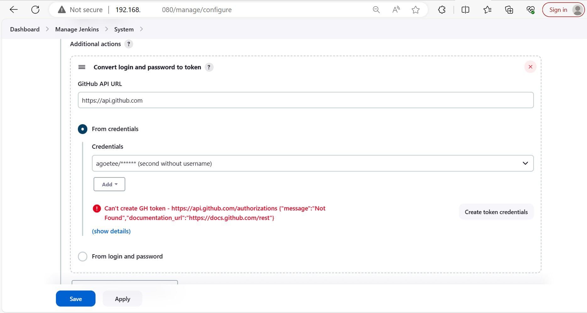
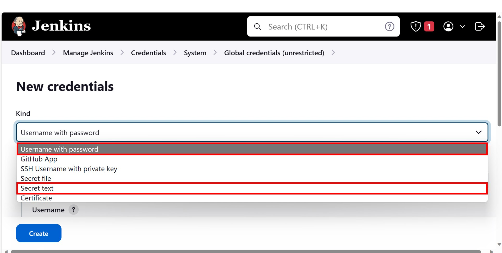

## Some Useful Git actions & commands

## ROLLING BACK

#### When you have __not staged__

Right after saving the file, run the `git checkout <filename>` command.

This will revert the file to the previous state before the edit was done.

#### When you have __staged__

After staging the file, run the `git checkout -- <filename>` command.

This will revert the file to the previous state before the change was done

> A command `git reset HEAD <filename>` was given but this did not work in my example.

#### RESOURCE
[Git Cheat Sheet](https://education.github.com/git-cheat-sheet-education.pdf)

This has a lot of helpful commands in the day-to-day activities of a dev

## Vagrant

### VAgrantfile

Added a vagrantfile to be used to set up a virtual VM in order to utilize the jenkins environment

The following commands are used:

- `vagrant init <boxname>` to initialize the box with the type of distro

- Edit the vagrant file to provision the suitable VM capacity required

- `vagrant up` to bring the machine up into operation

- `vagrant ssh` to connect into the machine via ssh

- `vagrant halt` to puth the machine into a stopped state

- `vagrant destroy` to discard the machine

## Reading Books

Reading books are a very good way to get started at understanding some concepts better.

They provide a lot of 

- Background

- Context

- Use cases and a whole lot.

However, for the few books I hae read to make my journey into tech a lot meaningful and understanding,
I have experienced some challenges. Some include:

- **Deprecated Information**.
The thing about tech is that, the pace with which things are improved is very fast.
I have experienced a lot of situations where at the time I was reading a tech book, the way of doing things have changed. Here are a few examples.:

- RUNNUNG PYTHON PROGRAM
Previously, python was run by entering `python <filename.py>` on the terminal. This was changed to `py <filename.py>`. You have to do additional finding of the error you get to understand the change.

- SETTING UP A GITHUB SERVER IN JENKINGS

More recently Was reading the book titled _Learning Continuous Integration with Jenkins 2ed_ by _Nikhil Pathania_. This book was published in 2017 and I was reading in 2023.

The amount of advancement between the Book's UI and the current Jenkins UI is very vast. The good thing is that most of the options are the same, only that the look and feel has changed.

I guess that is why it is the concept of Continuous Integration and Continuous Deployment. Making the changes come quickly and fast by automating the process of testing and publishing the new features.

What really happened?

__PROBLEM__

1. I wanted to set up a github server in my jenkins so that the two interfaces can communicate.

2. One needed to set up credentials to be used for this purpose

3. The credentials that hase been set up involves _username_ and _password_

4. That then had to be converted into a token in order to be used in the credential insertion

__SOLUTION__

1. Generate another Credential (Global), where the __Kind__ is _Secret text_

2. Select this in the Credential option.

3. Thats it. You can test the connection and it will work.